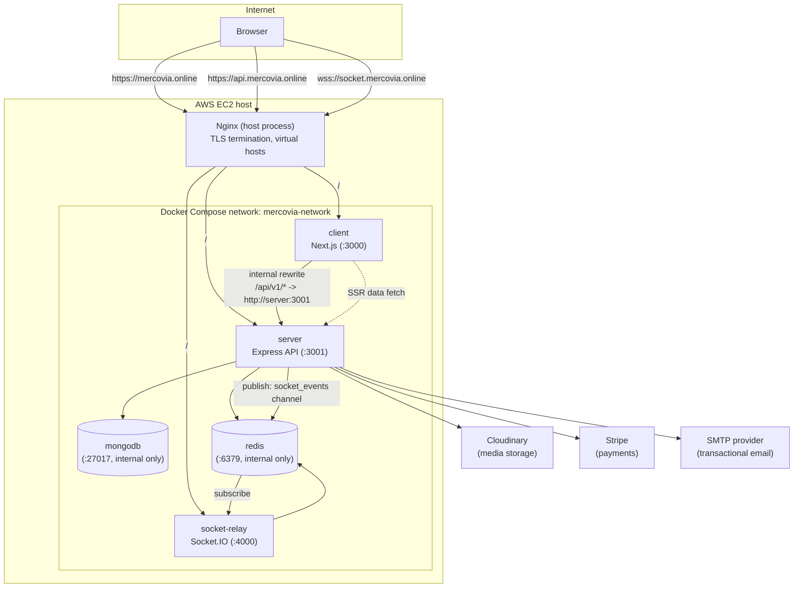

# Mercovia

> Production-oriented multi-vendor e-commerce marketplace demonstrating
> full-stack engineering, domain-oriented architecture, secure API
> design, data integrity, containerized deployment, and real-world
> buyer, seller, and admin workflows.

**Live application:** https://mercovia.online

## Overview

Mercovia is a full-stack marketplace where multiple sellers can manage
products, events, orders, coupons, conversations, payouts, and shop
operations while buyers can discover products, maintain a user-scoped
cart, complete checkout, track orders, request supported refunds, submit
eligible reviews, manage their account, and communicate with sellers.

The project is intentionally designed beyond a basic CRUD
implementation. The architecture addresses the boundaries that matter in
a marketplace:

-   authentication and role-based authorization
-   frontend/backend contract alignment
-   server-side validation
-   protected routes and deep-linking
-   inventory and order integrity
-   payment verification
-   seller balance integrity
-   pagination for production-scale list endpoints
-   RTK Query caching and invalidation
-   real-time messaging and notifications over a decoupled socket tier
-   external media storage
-   explicit loading, error, and empty states
-   administrative operations and moderation
-   containerized, reproducible deployment with automated CI/CD

## Key Features

### Buyer

-   Register and activate an account
-   Log in and maintain an authenticated session
-   Browse and search marketplace products
-   Filter products by category, price, and rating
-   View product details and seller information
-   Add products to a user-scoped cart
-   Revalidate product availability before checkout
-   Complete multi-shop checkout
-   Pay using supported payment methods
-   View all resulting orders and track status
-   Request supported refunds
-   Submit eligible product reviews
-   Manage profile information and addresses
-   Apply seller coupons during checkout
-   Communicate with sellers in real time
-   Receive live notifications

### Seller

-   Register and activate a seller account
-   Manage shop profile and shop media
-   Configure payout/withdrawal information
-   Create, update, and delete products and events
-   Upload product and event media
-   Manage incoming orders and update fulfillment status
-   Manage seller coupons
-   View seller balance and withdrawal history
-   Request withdrawals
-   Communicate with buyers in real time
-   Receive operational notifications

### Admin

-   Securely provision an administrator account
-   Access protected administrative routes
-   Review users, sellers, products, events, and orders
-   Manage withdrawals
-   Perform authorized platform-level corrective and moderation
    operations
-   Monitor marketplace data through protected admin APIs and UI
-   Receive live operational notifications (new orders, new sellers,
    withdrawal requests, status changes)

## System Architecture

Mercovia runs as five containerized services behind a host-level Nginx
reverse proxy on a single AWS EC2 instance, deployed via Docker Compose
and GitHub Actions.



The repository is split into four independently buildable applications:

```text
/
├── client/         # Next.js frontend (App Router, RTK Query, Redux Toolkit)
├── server/         # Express + TypeScript REST API
├── socket-relay/   # Standalone Socket.IO real-time relay service
├── deploy/nginx/   # Host-level Nginx reverse proxy configuration
├── docker-compose.yml
├── .env.example
├── .github/workflows/deploy.yml   # CI/CD pipeline
├── README.md
├── client/README.md
├── server/README.md
└── socket-relay/README.md
```

### Why four services instead of a monolith

-   **client** — presentation, routing, RTK Query cache, form handling,
    protected navigation. Never trusted for authorization decisions.
-   **server** — authoritative REST API: authentication, authorization,
    validation, business rules, persistence, payment verification.
    Stateless request/response only — it never holds a long-lived
    WebSocket connection itself.
-   **socket-relay** — a separate, always-on Socket.IO process. Splitting
    this out of `server` matters because HTTP request handling and
    long-lived WebSocket connections have different scaling and
    deployment characteristics; keeping them separate lets either be
    restarted, scaled, or redeployed independently without dropping the
    other, and keeps the REST API process free of persistent connection
    state.
-   **mongodb / redis** — run as first-class containerized services on
    the EC2 host (not managed cloud services in the current deployment),
    each with a dedicated Docker network and no published host ports.

### Request flow

**Authenticated HTTP requests (cookies must stay first-party):**

```text
Browser
  │  fetch("/api/v1/...", { credentials: "include" })
  ▼
Nginx (mercovia.online, TLS)
  ▼
client container (Next.js)
  │  next.config.ts rewrites() proxies /api/v1/:path*
  │  to BACKEND_API_URL (http://server:3001) over the
  │  Docker network — this keeps Set-Cookie responses
  │  same-origin from the browser's point of view
  ▼
server container (Express API)
  ▼
MongoDB / Redis / Cloudinary / Stripe / SMTP
```

The browser only ever calls the relative path `/api/v1/...` on
`mercovia.online`; it never talks to `api.mercovia.online` directly for
authenticated flows. `api.mercovia.online` is exposed separately for
health checks, direct API integration, and the Stripe webhook endpoint.

**Real-time (Socket.IO):**

```text
Browser
  │  POST /api/v1/socket/ticket  (cookie-authenticated, via the
  │  same client proxy as above)
  ▼
server issues a single-use ticket, stored in Redis
  (key: socket_ticket:<token>, 30s TTL)
  │
Browser
  │  connects to wss://socket.mercovia.online with
  │  { auth: { ticket } }
  ▼
Nginx  ──▶  socket-relay container
  │  validates + deletes the ticket against Redis,
  │  joins the socket to a room keyed by identity id
  ▼
Domain events (new order, order status change, chat message,
notification, stock update, seller balance change) are published
by the `server` process to the Redis channel `socket_events`;
`socket-relay` subscribes to that channel and emits the event only
to the room(s) it targets.
```

This design means the stateless API can restart or scale without
dropping open socket connections, and `socket-relay` never needs direct
database access or to re-implement authorization — it only trusts
tickets minted by the authenticated API.

## Domain Architecture

| Domain | Responsibility |
|---|---|
| Authentication / Users | Registration, activation, login, sessions, password recovery, account management |
| Shops | Seller identity, shop profile, payout information |
| Products | Catalog, pricing, stock, categories, media, reviews |
| Events | Seller promotional/event listings and management |
| Cart | User-scoped shopping state and availability checks |
| Orders | Checkout, shop-specific orders, fulfillment, refunds, order history |
| Payments | COD, Stripe PaymentIntents, payment confirmation, webhooks |
| Coupons | Seller-owned discount codes and checkout validation |
| Conversations / Messages | Buyer-seller communication and real-time updates |
| Withdrawals | Seller payout requests and administrative processing |
| Notifications | User-facing operational notifications and read/unread state |
| Administration | Platform-level management and moderation |

## Technology Stack

### Frontend
React / Next.js (App Router), TypeScript, Redux Toolkit, RTK Query,
React Hook Form, Zod, Tailwind CSS, Socket.IO client.

### Backend
Node.js, Express, TypeScript, MongoDB, Mongoose, Zod, JWT / HTTP-only
cookie authentication, bcryptjs, Redis (ioredis), Stripe, Cloudinary,
Socket.IO, Nodemailer, Helmet, CORS.

### Real-time
A standalone Socket.IO service (`socket-relay`) using
`@socket.io/redis-adapter`, decoupled from the API via Redis pub/sub.

### Infrastructure
Docker, Docker Compose, Nginx (host-level reverse proxy + TLS
termination), Let's Encrypt/Certbot, AWS EC2, GitHub Actions (CI/CD),
MongoDB (containerized, authenticated), Redis (containerized),
Cloudinary, Stripe.

## Local Development (without Docker)

This is the fastest loop for day-to-day feature work. Each application
is documented in full in its own README:

-   [`client/README.md`](./client/README.md)
-   [`server/README.md`](./server/README.md)
-   [`socket-relay/README.md`](./socket-relay/README.md)

### 1. Clone the repository

```bash
git clone <repository-url>
cd <repository-folder>
```

### 2. Configure and run the backend

```bash
cd server
npm install
```

Create `server/.env` — see [`server/README.md`](./server/README.md) for
the full variable list. At minimum:

```env
NODE_ENV=development
PORT=3001
FRONTEND_URL=http://localhost:3000
MONGO_URI=mongodb://localhost:27017/mercovia
```

```bash
npm run dev
```

### 3. Configure and run the socket relay (optional for most feature work)

```bash
cd socket-relay
npm install
```

Create `socket-relay/.env`:

```env
PORT=4000
REDIS_URL=redis://localhost:6379
FRONTEND_URL=http://localhost:3000
```

```bash
npm run dev
```

Real-time features (chat, live notifications, live stock/balance
updates) require this service and a running Redis instance. Everything
else works without it.

### 4. Configure and run the frontend

```bash
cd client
npm install
```

Create `client/.env.local`:

```env
NEXT_PUBLIC_API_URL=http://localhost:3001/api/v1
NEXT_PUBLIC_SOCKET_URL=http://localhost:4000
```

```bash
npm run dev
```

Visit `http://localhost:3000`.

> **Note on env var names:** the frontend reads `NEXT_PUBLIC_API_URL`
> and `NEXT_PUBLIC_SOCKET_URL` (see `client/config/env.ts` and
> `client/lib/socket.ts`). `NEXT_PUBLIC_SERVER_URI` is **not** a
> variable this codebase reads — do not use it.

### 5. Prerequisites

-   Node.js and npm
-   A reachable MongoDB instance
-   A reachable Redis instance (required for auth sessions, activation
    tokens, socket tickets, presence, and pub/sub — not optional even
    outside of chat)
-   Cloudinary, Stripe, and SMTP credentials for full end-to-end testing

## Local Development (with Docker Compose)

The same Docker Compose stack used in production can be run locally to
validate container builds and cross-service networking before
deploying.

```bash
cp .env.example .env
# fill in .env with local/test values
docker compose build
docker compose up -d
docker compose ps
```

Notes:

-   All container ports are bound to `127.0.0.1` only (`3000`, `3001`,
    `4000`), matching production, where Nginx is the only public
    entry point. Locally this means the app is reachable at
    `http://localhost:3000` without a reverse proxy.
-   `mongodb` runs with `--auth` enabled and a named volume
    (`mongodb_data`); set `MONGO_ROOT_USER` / `MONGO_ROOT_PASSWORD` in
    `.env`.
-   Set `PUBLIC_ORIGIN=http://localhost:3000` and
    `SOCKET_ORIGIN=http://localhost:4000` in `.env` for a fully local
    stack.
-   Rebuild after any dependency or Dockerfile change:
    `docker compose build <service>`.

## AWS Production Deployment

### Topology

A single EC2 instance runs:

-   **Nginx**, installed directly on the host (not containerized) — the
    sole public entry point on ports 80/443. Configuration:
    [`deploy/nginx/mercovia.conf`](./deploy/nginx/mercovia.conf).
-   **Docker Compose stack** (`docker-compose.yml`): `mongodb`, `redis`,
    `server`, `socket-relay`, `client` — all bound to `127.0.0.1` and
    reachable only from Nginx on the same host.

### DNS and TLS

Three subdomains, each with its own Nginx `server` block and a shared
Let's Encrypt certificate (`mercovia.online` + SANs):

| Subdomain | Proxies to |
|---|---|
| `mercovia.online`, `www.mercovia.online` | `client` (`:3000`) |
| `api.mercovia.online` | `server` (`:3001`) |
| `socket.mercovia.online` | `socket-relay` (`:4000`) |

All three redirect HTTP → HTTPS. The socket subdomain sets
`proxy_read_timeout`/`proxy_send_timeout` to `86400` and forwards the
`Upgrade`/`Connection` headers for WebSocket upgrades. Certificates are
renewed via Certbot's standard webroot flow at
`/var/www/certbot/.well-known/acme-challenge/`, which Nginx serves
directly on port 80 before redirecting everything else to HTTPS.

### Environment configuration

Copy [`.env.example`](./.env.example) to `.env` on the EC2 host (never
committed) and fill in real values:

```env
MONGO_ROOT_USER=
MONGO_ROOT_PASSWORD=
ACCESS_TOKEN=
REFRESH_TOKEN=
JWT_SECRET_KEY=
JWT_EXPIRES=5
ACCESS_TOKEN_EXPIRE=2
REFRESH_TOKEN_EXPIRE=24
ENCRYPTION_KEY=
CLOUDINARY_CLOUD_NAME=
CLOUDINARY_API_KEY=
CLOUDINARY_API_SECRET=
STRIPE_SECRET_KEY=
STRIPE_PUBLISHABLE_KEY=
STRIPE_WEBHOOK_SECRET=
STRIPE_CURRENCY=usd
COMPANY_NAME=Mercovia
SMPT_HOST=
SMPT_PORT=587
SMTP_SERVICE=
SMTP_MAIL=
SMTP_PASSWORD=
ADMIN_NAME=Admin
ADMIN_EMAIL=
ADMIN_PASSWORD=
PUBLIC_ORIGIN=https://mercovia.online
SOCKET_ORIGIN=https://socket.mercovia.online
```

`docker-compose.yml` derives every container's runtime environment from
these values — including build-time frontend arguments
(`NEXT_PUBLIC_API_URL=/api/v1`, `NEXT_PUBLIC_SOCKET_URL`,
`NEXT_PUBLIC_SITE_URL`, and the server-only `BACKEND_API_URL` used for
the Next.js rewrite proxy and SSR data fetching). `ACCESS_TOKEN`,
`REFRESH_TOKEN`, `JWT_SECRET_KEY`, and `ENCRYPTION_KEY` are **required**
once `NODE_ENV=production` — the server intentionally throws on boot if
they're missing, rather than silently falling back to development
defaults.

### CI/CD

[`.github/workflows/deploy.yml`](./.github/workflows/deploy.yml) runs on
every push to the `aws-deploy` branch:

1.  Validates `docker-compose.yml` syntax with `docker compose config`
    (using placeholder values — nothing here touches the server).
2.  Configures SSH access using the `EC2_SSH_KEY` secret.
3.  SSHes into the host and:
    -   `git fetch origin aws-deploy && git reset --hard origin/aws-deploy`
    -   `docker compose build`
    -   `docker compose up -d --remove-orphans`
    -   Verifies exactly 5 services report `running`; dumps logs and
        fails the job otherwise.
4.  Curls `https://api.mercovia.online/api/v1/health-check` and expects
    a successful (2xx) response.
5.  Curls `https://mercovia.online/` and expects HTTP `200`.

Required repository secrets: `EC2_SSH_KEY`, `EC2_HOST`, `EC2_USER`,
`EC2_APP_DIR`.

Deployment is intentionally simple (SSH + Compose) rather than an
orchestrator, matching the scale of a single-host production system;
the pipeline still enforces config validation and a post-deploy health
gate so a bad deploy fails the workflow instead of silently going live
broken.

### Health checks

`GET /api/v1/health-check` on the `server` reports both dependency
states and only returns `200` when both are healthy:

```json
{
  "success": true,
  "status": "ok",
  "timestamp": "2026-01-01T00:00:00.000Z",
  "uptime": 1234,
  "services": { "db": "connected", "redis": "connected" }
}
```

`server/Dockerfile` runs a container-level `HEALTHCHECK` against this
same endpoint. `client/Dockerfile` and `socket-relay/Dockerfile` have
their own container health checks against `/` and the process itself,
respectively. `mongodb` and `redis` use `mongosh`/`redis-cli` ping
checks, and `server`/`socket-relay` both `depends_on: condition:
service_healthy` for Redis (and Mongo, for `server`) before starting.

### Operational scripts in production

The production server image only ships compiled output
(`server/dist/`) and production dependencies — `tsx` and the TypeScript
compiler are **not** present in the running container. Run compiled
scripts directly with `node`, not the `tsx`-based commands from
`package.json`:

```bash
# Provision or promote an admin account
docker compose exec server node dist/scripts/seedAdmin.js

# Clean up orphaned Cloudinary avatar uploads (run periodically, e.g. via host cron)
docker compose exec server node dist/scripts/cleanupOrphanedUploads.js
```

See [`server/README.md`](./server/README.md) for the required
environment variables for each script and for the local (non-Docker)
equivalents.

## Security Practices

-   HTTP-only, `Secure`, cross-site-safe (`SameSite=None` in production)
    authentication cookies
-   Role-based authorization plus seller/resource ownership checks on
    every sensitive mutation
-   Server-side request validation (Zod) at the API boundary
-   Password hashing (bcrypt)
-   Origin-checked CORS restricted to `FRONTEND_URL`
-   Lightweight CSRF mitigation: state-changing cookie-authenticated
    requests are rejected unless their `Origin` header matches an
    allowed origin
-   Helmet security headers
-   Method-scoped rate limiting (tighter limits on writes and on
    auth-sensitive routes)
-   Stripe payment verification via signed webhooks, never trusting a
    client-reported payment status
-   Encrypted-at-rest seller bank account numbers, masked on read
-   Redis-backed, single-use, short-TTL socket authentication tickets
    (no long-lived credentials passed to the socket tier)
-   Protected admin routes, enforced server-side regardless of frontend
    UI state
-   Environment-based secrets; production boot fails fast if critical
    secrets are unset
-   No secrets committed; all containers pull configuration from `.env`
    at deploy time
-   Docker containers run with minimal published ports — only Nginx is
    publicly reachable

The frontend is never the security boundary; every sensitive decision
is re-checked server-side.

## Troubleshooting

### CORS / 403 "Request origin not allowed"

Verify `FRONTEND_URL` (server, socket-relay) exactly matches the
browser's origin, including scheme and absence/presence of `www.`.

### Authentication works but refresh logs the user out

Check HTTP-only cookie attributes, the frontend's effective API base
URL, backend CORS `credentials` handling, and HTTPS/cookie settings in
production. In the Docker/Nginx setup, confirm the client's Next.js
rewrite is actually proxying `/api/v1/*` to the `server` container
(cookies must stay first-party on `mercovia.online`).

### MongoDB connection errors

Check `MONGO_URI`, credentials, URL encoding for special characters,
and — in Docker — that the `mongodb` service is healthy
(`docker compose ps`) before `server` starts.

### Redis errors

Verify the Redis URL/host/port and credentials. Redis is required for
sessions, activation tokens, socket tickets, and the `socket_events`
pub/sub bridge — it is not an optional dependency.

### Cloudinary uploads fail

Verify Cloudinary cloud name, API key, and API secret.

### Stripe payment fails

Use test-mode keys locally. Verify the webhook signing secret and that
the webhook route's raw-body handling has not been altered by
middleware ordering (see `server/src/app.ts`).

### Messaging / notifications don't update in real time

Check, in order: the `socket-relay` container/process is running and
healthy; `NEXT_PUBLIC_SOCKET_URL` resolves to it; the browser's
WebSocket connection in DevTools' Network panel actually upgrades
(101); `POST /api/v1/socket/ticket` succeeds (requires an authenticated
session); and that `server` and `socket-relay` share the same `REDIS_URL`.

### Admin routes are inaccessible

Verify the authenticated user has `role: "admin"` in MongoDB and that
both backend authorization and frontend route protection are checked
against the current session — re-authenticate after promoting a user.

### Deployment workflow fails at the "container status" step

SSH into the host and run `docker compose ps` and
`docker compose logs --tail=100 <service>` directly; the workflow's
failure output only prints the last 50 lines per service.

## Engineering Standards

-   domain-oriented modules
-   explicit API contracts
-   server-side authorization
-   validation at the API boundary
-   centralized error handling
-   RTK Query for server state
-   pagination for list endpoints
-   atomic operations for concurrency-sensitive state
-   external media storage
-   explicit loading/error/empty UI states
-   environment-based configuration
-   small, focused modules
-   infrastructure and deployment steps kept in version control
    alongside the code they deploy

## Project Documentation

-   [`client/README.md`](./client/README.md) — frontend architecture,
    environment variables, and local setup
-   [`server/README.md`](./server/README.md) — backend architecture,
    environment variables, operational scripts, and API notes
-   [`socket-relay/README.md`](./socket-relay/README.md) — real-time
    service architecture, Redis adapter, and ticket-based auth

## Production Boundary

Mercovia is a production-oriented portfolio system. That does not imply
that every enterprise concern is implemented.

A full enterprise deployment may additionally require dedicated
observability infrastructure (metrics/tracing/log aggregation), managed
database services with automated backups, multi-host/multi-AZ
orchestration, formal disaster recovery, advanced fraud detection,
large-scale analytics, secrets management infrastructure, compliance
controls, blue/green or canary release governance, and dedicated
operational support.

Those concerns should not be represented as implemented unless they
actually exist in the system.
