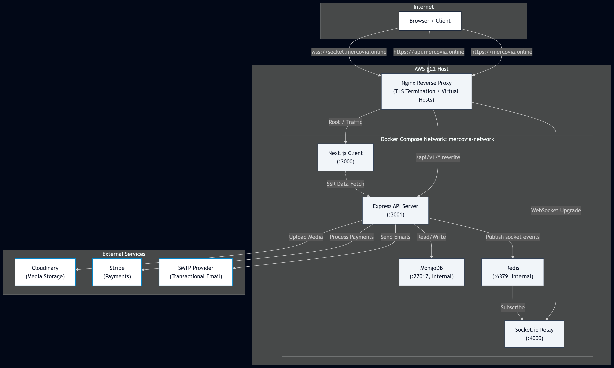

# Mercovia

Production-oriented multi-vendor e-commerce marketplace demonstrating full-stack engineering, domain-oriented architecture, secure API design, data integrity, containerized deployment, and real-world buyer, seller, and admin workflows.

**Live application:** [https://mercovia.online](https://mercovia.online)

---

## Overview

Mercovia is a full-stack marketplace where multiple sellers can manage products, events, orders, coupons, conversations, payouts, and shop operations while buyers can discover products, maintain a user-scoped cart, complete checkout, track orders, request supported refunds, submit eligible reviews, manage their account, and communicate with sellers.

The project is intentionally designed beyond a basic CRUD implementation. The architecture addresses the boundaries that matter in a marketplace:

*   Authentication and role-based authorization
*   Frontend/backend contract alignment
*   Server-side validation
*   Protected routes and deep-linking
*   Inventory and order integrity
*   Payment verification
*   Seller balance integrity
*   Pagination for production-scale list endpoints
*   RTK Query caching and invalidation
*   Real-time messaging and notifications over a decoupled socket tier
*   External media storage
*   Explicit loading, error, and empty states
*   Administrative operations and moderation
*   Containerized, reproducible deployment with automated CI/CD

---

## Key Features

### Buyer
*   Register and activate an account
*   Log in and maintain an authenticated session
*   Browse and search marketplace products
*   Filter products by category, price, and rating
*   View product details and seller information
*   Add products to a user-scoped cart
*   Revalidate product availability before checkout
*   Complete multi-shop checkout
*   Pay using supported payment methods
*   View all resulting orders and track status
*   Request supported refunds
*   Submit eligible product reviews
*   Manage profile information and addresses
*   Apply seller coupons during checkout
*   Communicate with sellers in real time
*   Receive live notifications

### Seller
*   Register and activate a seller account
*   Manage shop profile and shop media
*   Configure payout/withdrawal information
*   Create, update, and delete products and events
*   Upload product and event media
*   Manage incoming orders and update fulfillment status
*   Manage seller coupons
*   View seller balance and withdrawal history
*   Request withdrawals
*   Communicate with buyers in real time
*   Receive operational notifications

### Admin
*   Securely provision an administrator account
*   Access protected administrative routes
*   Review users, sellers, products, events, and orders
*   Manage withdrawals
*   Perform authorized platform-level corrective and moderation operations
*   Monitor marketplace data through protected admin APIs and UI
*   Receive live operational notifications (new orders, new sellers, withdrawal requests, status changes)

---

## System Architecture

Mercovia runs as five containerized services behind a host-level Nginx reverse proxy on a single AWS EC2 instance, deployed via Docker Compose and GitHub Actions.



### Repository Structure
```text
/
├── client/                 # Next.js frontend (App Router, RTK Query, Redux Toolkit)
├── server/                 # Express + TypeScript REST API
├── socket-relay/           # Standalone Socket.IO real-time relay service
├── deploy/nginx/           # Host-level Nginx reverse proxy configuration
├── docker-compose.yml
├── .env.example
├── .github/workflows/deploy.yml
├── README.md
├── client/README.md
├── server/README.md
└── socket-relay/README.md

```

### Why Four Services Instead of a Monolith?

* **client:** Presentation, routing, RTK Query cache, form handling, protected navigation. Never trusted for authorization decisions.
* **server:** Authoritative REST API: authentication, authorization, validation, business rules, persistence, payment verification. Stateless request/response only.
* **socket-relay:** A separate, always-on Socket.IO process. Decoupled to allow scaling/restarting independently without dropping HTTP connections.
* **mongodb / redis:** First-class containerized services on the EC2 host with dedicated Docker network and no published host ports.

---

## Domain Architecture

| Domain | Responsibility |
| --- | --- |
| **Authentication / Users** | Registration, activation, login, sessions, password recovery, account management |
| **Shops** | Seller identity, shop profile, payout information |
| **Products** | Catalog, pricing, stock, categories, media, reviews |
| **Events** | Seller promotional/event listings and management |
| **Cart** | User-scoped shopping state and availability checks |
| **Orders** | Checkout, shop-specific orders, fulfillment, refunds, order history |
| **Payments** | COD, Stripe PaymentIntents, payment confirmation, webhooks |
| **Coupons** | Seller-owned discount codes and checkout validation |
| **Conversations / Messages** | Buyer-seller communication and real-time updates |
| **Withdrawals** | Seller payout requests and administrative processing |
| **Notifications** | User-facing operational notifications and read/unread state |
| **Administration** | Platform-level management and moderation |

---

## Technology Stack

* **Frontend:** React / Next.js (App Router), TypeScript, Redux Toolkit, RTK Query, React Hook Form, Zod, Tailwind CSS, Socket.IO client.
* **Backend:** Node.js, Express, TypeScript, MongoDB, Mongoose, Zod, JWT / HTTP-only cookie authentication, bcryptjs, Redis (ioredis), Stripe, Cloudinary, Socket.IO, Nodemailer, Helmet, CORS.
* **Real-time:** A standalone Socket.IO service (socket-relay) using `@socket.io/redis-adapter`, decoupled from the API via Redis pub/sub.
* **Infrastructure:** Docker, Docker Compose, Nginx (host-level), Let's Encrypt/Certbot, AWS EC2, GitHub Actions (CI/CD), MongoDB, Redis, Cloudinary, Stripe.

---

## Deployment & Development

### Local Development (without Docker)

1. Clone the repository and `cd` into the directory.
2. **Backend:** `cd server`, `npm install`, configure `.env`, `npm run dev`.
3. **Socket Relay:** `cd socket-relay`, `npm install`, configure `.env`, `npm run dev`.
4. **Frontend:** `cd client`, `npm install`, configure `.env.local`, `npm run dev`.
5. Visit `http://localhost:3000`.

### Local Development (with Docker Compose)

```bash
cp .env.example .env
docker compose build
docker compose up -d

```

### AWS Production Deployment

* **Topology:** Nginx host-level proxy + Docker Compose stack on EC2.
* **DNS/TLS:** Three subdomains (mercovia.online, api.mercovia.online, socket.mercovia.online) proxied via Nginx.
* **CI/CD:** Automated pipeline via GitHub Actions on `aws-deploy` branch (validation, build, deploy, health check).

---

## Security Practices

* HTTP-only, Secure, cross-site-safe authentication cookies.
* Role-based authorization + resource ownership checks.
* Server-side validation (Zod) at the API boundary.
* Origin-checked CORS.
* CSRF mitigation.
* Method-scoped rate limiting.
* Stripe verification via signed webhooks.
* Encrypted-at-rest sensitive data.
* Minimal container attack surface (internal-only ports).

---

## Engineering Standards

* Domain-oriented modules.
* Explicit API contracts.
* Server-side authorization and validation.
* Centralized error handling.
* RTK Query for state management.
* Atomic operations for concurrency.
* Infrastructure as Code (Docker/CI).


## Project Documentation
- [`client/README.md`](./client/README.md) — frontend architecture,
environment variables, and local setup
- [`server/README.md`](./server/README.md) — backend architecture,
environment variables, operational scripts, and API notes
- [`socket-relay/README.md`](./socket-relay/README.md) - real-time
service architecture, Redis adapter, and ticket-based auth


## Production Boundary

Mercovia is a production-oriented portfolio system. That does not imply
that every enterprise concern is implemented.

A full enterprise deployment may additionally require dedicated
observability infrastructure (metrics/tracing/log aggregation), managed
database services with automated backups, multi-host/multi-AZ
orchestration, formal disaster recovery, advanced fraud detection,
large-scale analytics, secrets management infrastructure, compliance
controls, blue/green or canary release governance, and dedicated
operational support.

Those concerns should not be represented as implemented unless they
actually exist in the system.
